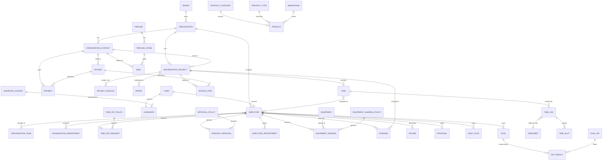
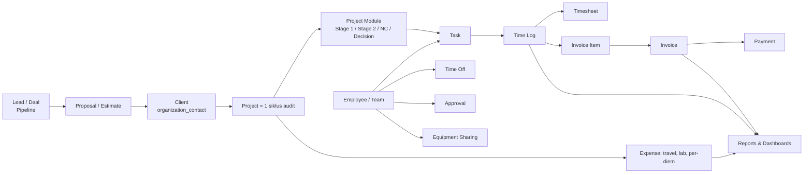

# Ever Gauzy Local — Seeding Semua Modul + Gap Analysis vs OneAlpha

**Tanggal:** 2026-09-15
**Stack:** `~/AI-Workspace/projects/sandbox/ever-gauzy/.deploy/local` (docker compose)
**URL:** webapp http://localhost:4200 · API http://localhost:3000/api · Mailpit http://localhost:8025
**Login:** `admin@ever.co` / `admin` — Org: **CBQA Global Indonesia** (IDR, Asia/Jakarta)

Seeding dilakukan lewat REST API (bukan SQL langsung), script ada di scratchpad sesi:
`gz.py` (client), `seed_gauzy.py` (core), `seed_modules.py` (pass 1), `seed_pass2.py`, `seed_pass3.py`.

Nama klien diambil dari registry perusahaan OneAlpha (`companies_merged_VERIFIED_prod.csv`).
Nama orang, tarif, timesheet, dan angka keuangan **sintetis** (bukan PII nyata).

---

## 1. Data yang ter-seed (per menu)

| Menu | Sub-modul | Jumlah |
|---|---|---|
| **Dashboards** | Teams / Project Mgmt / Time Tracking / Accounting | terisi dari data di bawah |
| **Accounting** | Invoices `8` (5 invoice + 3 estimate), Invoice Items `15`, Payments `4`, Income `5`, Expenses `30`, Expense Categories `4`, Recurring Expense (org `3` / employee `3`) | 97 |
| **Sales** | Pipelines `2` (9 stage), Deals `4`, Proposals `4`, Estimates `3` | 13 |
| **Tasks** | Tasks `56`, Project Modules `4`, Sprints `3`, Daily Plans `4`, Task Statuses/Priorities/Sizes (default per project) | 67+ |
| **Jobs** | Job Presets `3`, Proposal Templates `3` | 6 |
| **Employees** | Employees `12`, Timesheets `25`, Time Logs `115`, Appointments `4`, Approvals `4` + Policy `3`, Employee Level `4`, Positions `5`, Time Off `4` + Policy `3`, Recurring Expense `3`, Candidates `4` + Source `4`, Awards `3`, Skills `5`, Availability Slots `4` | 200+ |
| **Organization** | Projects `8`, Departments `4`, Teams `3`, Vendors `4`, Documents `4`, Employment Types `4`, Awards `3`, Languages `3`, Equipment `4` + Sharing `4` + Policy `3`, Tags `6`, Help Center `3` + Artikel `4` | 57 |
| **Contacts** | Clients `10`, Customers `3`, Leads `4` | 17 |
| **Goals** | Goals `4`, Key Results `5`, KPI `3`, Time Frames `2` | 14 |
| **Reports** | derivatif (Time & Activity, Weekly, Amounts Owed, Project Budgets, Expense) — terisi otomatis dari time log + expense + invoice | — |
| **Inventory** | Products `4`, Product Categories `3`, Product Types `2`, Warehouses `3` | 12 |

Semua data **saling terhubung**: Client → Project → Module → Sprint → Task → Time Log → Timesheet →
Invoice Item → Invoice → Payment, dan Employee → Team/Department → Task/Time Off/Approval/Goal.

**1 anomali ditemukan:** endpoint `POST /api/merchants` mengembalikan 201 tanpa body dan **tidak
mempersist baris** (tabel `merchant` tetap 0); `GET /api/merchants` balas `400 {}`. Ini bug di image
`gauzy-api` yang dipakai, bukan kesalahan payload — modul Merchant/Store dilewati.

---

## 2. Diagram relasi data antar modul



**Alur bisnis yang terbentuk di data seed:**



---

## 3. Gap: ada di OneAlpha, TIDAK ada di Gauzy

Basis pembanding: `auditqv2-api` (84 model Eloquent, 270+ route) dan `auditqv2-main`
(modul `master`, `monitoring`, `tools`, `dashboard`).

### 3.1 Domain sertifikasi — **tidak ada sama sekali di Gauzy** (gap terbesar)

| OneAlpha | Model/Modul | Padanan Gauzy |
|---|---|---|
| **Certificate** (nomor, layout, status, masa berlaku, list nomor sertifikat) | `Certificate`, `CertificateLayout`, `CertificateStatus`, `ListCertificate` | ❌ tidak ada konsep sertifikat |
| **Standard & Standard Version** (ISO 9001:2015, ISCC EU v3.1, dst.) | `Standard`, `StandardVersion`, `FormItemStandardVersion` | ❌ tidak ada |
| **Audit Cycle** (siklus 3 tahun: initial → surveillance 1 & 2 → recert) | `AuditCycle`, `FormAuditProgramThreeYears` | ⚠️ hanya Project + Sprint (flat, tanpa siklus) |
| **Finding / NC Management** (kategori, requirement, status closure) | `FormFinding`, `FormFindingMaster`, `FindingCategory`, `FindingRequirement` | ❌ hanya Task generik |
| **Form engine dinamis** (FAPP-01..08, CIF, CL, CNF, FTRD-01/02, Audit Plan, Audit Report, Transfer Evaluation) | `Form`, `FormItem`, `FormVar`, `FormVarCategory`, 15+ model form | ❌ tidak ada form builder sama sekali |
| **Multisite audit & sampling** | `AuditMultisite`, `ClientSites` | ❌ Client tunggal, tanpa site |
| **Scope & material ISCC** | `IsccScope`, `IsccMaterial`, `IsccMaterialCategory` | ❌ |
| **EA code / sector klien** | `EA`, `ClientSector` | ❌ |
| **Kualifikasi personel** (technical & personnel qualification, mapping auditor ↔ standar/EA) | `PersonnelQualification`, `TechnicalQualification`, `staff_qualification_map` | ⚠️ hanya `Skill` + `EmployeeLevel` (tanpa matriks kompetensi & validitas) |
| **Impartiality / LVV** (signing impartiality, scheme, NEK) | `LvvSigningImpartiality`, `LvvScheme`, `LvvNek` | ❌ |
| **Partner / subkontraktor audit** | `Partner` | ⚠️ `organization_vendor` (tanpa konteks akreditasi) |
| **Utilization auditor & mandays objective** | `UtilizationAuditor`, `WeeklyMandaysObjective` | ⚠️ Time & Activity report (tanpa target mandays) |
| **Non-audit calendar & public holiday** | `NonAuditCalendar`, `PublicHoliday` | ❌ (Time Off ada, kalender non-audit tidak) |
| **Audit workflow granular** (activity, access, permission, historical, rollback, sendback, request delete/document) | `AuditActivity*`, `RollbackProcess`, `SendbackDocument`, `RequestDeleteAudit`, `RequestDocument` | ❌ tidak ada state machine dokumen |
| **Document control** (tipe dokumen, versi, historical audit document) | `Document`, `DocumentType`, `AuditDocumentHistorical` | ⚠️ `organization_document` = link URL saja, tanpa versi/approval |
| **Monitoring sertifikat & audit** (dashboard expiry, due surveillance) | modul `monitoring/*` | ❌ |
| **Notifikasi email per event audit** | `AuditEmailNotification(Type)` | ⚠️ email template ada, trigger audit-domain tidak |
| **RBAC granular per modul & aktivitas** | `ModuleAccess`, `ModulePermission`, `ActivityAccess`, `ActivityPermission`, `ActivityStatus` | ⚠️ Gauzy RBAC = role + permission global, bukan per-record/per-activity |

### 3.2 Ada di Gauzy, TIDAK ada di OneAlpha (nilai tambah)

Time tracking dengan screenshot/aktivitas, Timesheet approval, Invoice/Estimate + Payment,
Expense & Recurring Expense, Sales Pipeline & Deals, Proposal, Goals/OKR + KPI, Equipment sharing,
Recruitment (candidate, interview, feedback), Help Center, Inventory/Warehouse, multi-tenant +
multi-organization, integrasi (GitHub, Jira, Hubstaff, Make.com), Job marketplace.

---

## 4. Rekomendasi: apakah Gauzy layak jadi referensi rebuild OneAlpha?

**Jawaban singkat: ya sebagai *referensi arsitektur & modul pendukung*, tidak sebagai *base aplikasi*.**

### Layak dipakai (ambil polanya)
1. **Arsitektur multi-tenant** — pola `tenantId` + `organizationId` di setiap entity, plus
   `Tenant-Id` header + guard. OneAlpha sekarang single-tenant; ini blueprint siap pakai kalau
   CBQA mau melayani beberapa badan sertifikasi / cabang.
2. **Time tracking → timesheet → invoice** — persis yang hilang di OneAlpha untuk mengubah
   `UtilizationAuditor` + `WeeklyMandaysObjective` jadi angka biaya & tagihan otomatis.
3. **RBAC & permission layer** (`role_permission`, 1.592 baris seed) — struktur permission
   enum-based yang rapi untuk menggantikan `ModulePermission`/`ActivityPermission` yang ad-hoc.
4. **Modul pendukung yang bisa di-port apa adanya:** Expense, Payment, Invoice/Estimate,
   Approval Policy, Equipment Sharing, Candidate/Recruitment, Goals/KPI, Help Center.
5. **CQRS + NestJS + TypeORM** — struktur command/query & DTO validation-nya konsisten; bagus
   sebagai contoh kalau rebuild OneAlpha mau pindah dari Laravel monolit ke service modular.

### Tidak layak sebagai base
1. **Nol domain sertifikasi.** Certificate, Standard/Version, Audit Cycle, Finding/NC, Multisite,
   EA code, kualifikasi auditor, impartiality — semuanya harus dibangun dari nol. Itu justru
   **inti nilai** OneAlpha; Gauzy hanya menutup lapisan "back-office".
2. **Tidak ada form engine.** FAPP-01..08, CIF, CL, CNF, FTRD adalah form dinamis
   berversi-standar. Gauzy tak punya padanan — dan ini modul paling mahal di OneAlpha.
3. **Model "Project" terlalu longgar** untuk siklus audit 3 tahun dengan stage, sampling multisite,
   dan surveillance terjadwal. Memaksakan Project = audit akan bocor di surveillance & recert.
4. **Biaya adaptasi > biaya bangun.** Repo Gauzy sangat besar (Angular + NestJS + Electron desktop
   apps). Menambah domain sertifikasi ke dalamnya berarti fork permanen dan kehilangan jalur upgrade.
5. **Kualitas rilis belum solid** — contoh konkret dari sesi ini: endpoint `merchants` rusak,
   beberapa DTO tidak terdokumentasi di Swagger, enum status tak konsisten (`FULLY_PAID` vs `Paid`).

### Rekomendasi eksekusi
- **Jangan fork Gauzy.** Pertahankan OneAlpha/AuditQV2 sebagai *system of record* untuk domain
  sertifikasi.
- **Pinjam 3 hal saja** ke roadmap rebuild OneAlpha, prioritas urut:
  1. Time tracking → timesheet → mandays → invoice (langsung menutup gap monetisasi).
  2. Skema multi-tenant + RBAC berbasis permission enum.
  3. Approval policy + equipment/resource sharing untuk logistik audit lapangan.
- **Pakai instance lokal ini sebagai *reference implementation*** — sudah berisi data
  CBQA-flavored, bisa dibuka berdampingan saat mendesain modul baru, dan API-nya bisa di-*probe*
  (`/swg` Swagger UI aktif) untuk melihat kontrak DTO-nya.

---

## 5. Cara menjalankan ulang

```bash
cd ~/AI-Workspace/projects/sandbox/ever-gauzy/.deploy/local
docker compose up -d      # start
docker compose down       # stop (data persist di volume)
```

Reset data + seed ulang: `docker compose down -v && docker compose up -d`, tunggu API healthy,
lalu jalankan `seed_gauzy.py` → `seed_modules.py` → `seed_pass2.py` → `seed_pass3.py`.
